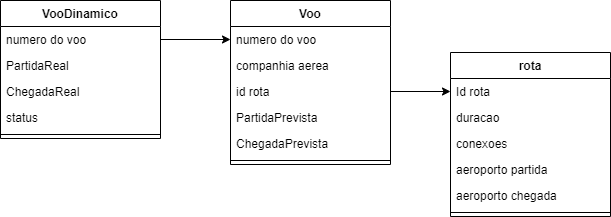

# Django basic project
## Group 8

<!-- ALL-CONTRIBUTORS-LIST:START - Do not remove or modify this section -->
<!-- prettier-ignore-start -->
<!-- markdownlint-disable -->
<table>
  <tr>
    <td align="center"><a href="https://github.com/RicardoHonda"><br /><sub><b>Ricardo Tamay Honda <br/> 11803778</b></sub></a><br /></td>
    <td align="center"><a href="https://github.com/DamaralHenrique"><br /><sub><b>Henrique D'Amaral Matheus<br/>11345513</b></sub></a><br /></td>
    <td align="center"><a href="https://github.com/Edu-Hiroshi"><br /><sub><b>Eduardo Hiroshi Ito<br/>11806868</b></sub></a><br /></td>
  </tr>
</table>

## Overview

The project technical description can be found on the `assets/documents` folder:
- [Casos de uso](https://github.com/DamaralHenrique/DjangoApp/blob/main/assets/documents/Casos_de_uso.pdf)
- [Modelo de Análise](https://github.com/DamaralHenrique/DjangoApp/blob/main/assets/documents/Modelo%20de%20An%C3%A1lise.pdf)
- [Plano de testes de validação](https://github.com/DamaralHenrique/DjangoApp/blob/main/assets/documents/Plano%20de%20testes%20de%20valida%C3%A7%C3%A3o.pdf)
- [Relatório de Testes de Validação](https://github.com/DamaralHenrique/DjangoApp/blob/main/assets/documents/Aula%2012%20-%20Relat%C3%B3rio%20de%20Testes%20de%20Valida%C3%A7%C3%A3o.pdf)

The folder `/assests/images` contains the following diagrams:
- Classes diagrams (class 3);
- DER (class 6);
- Use cases navigation diagram (class 7).



## 🚀 Quick Start

To get this project up and running locally on your computer:
1. Create a virtual environment and activate it using the following commands:
   ```
   python -m venv env
   .\env\bin\Activate.ps1 # or .\env\scripts\Activate.ps1
   ```

2. Then, install the project dependencies running the following command:
   ```
   pip install -r requirements.txt  
   ```

3. Assuming you have Python setup, run the following commands:
   ```
   python manage.py runserver
   ```
   
4. If everything went well, the following message will be shown on the terminal: "Starting development server at http://127.0.0.1:8000". You will then be able to open `http://localhost:8000`, and the following message will appear **"PCS3643 - Laboratório de Engenharia de Software I"**

## 🧪 Testing

Creating a database to make tests (repeat these steps after modifying the python files):
1. On the menage.py script folder:
```
python manage.py makemigrations
```

2. To create the database, execute:
```
python manage.py migrate
```

3. The tests are defined in the `flight\test.py` file. To execute them, run:
```
python manage.py test
```

### Login test

Use the following credentials to test the login for each function:

CRUD

```
{
   id: "operador",
   password: "1234",
}
```

MONITORAMENTO
```
{
   id: "funcionario",
   password: "1234",
},
{
   id: "torre",
   password: "1234",
},
{
   id: "piloto",
   password: "1234",
}
```

GERAR RELATÓRIOS
```
{
   id: "gerente",
   password: "1234",
}
```

The visible pages for each function can be found in the "diagrama_casos-de_uso.png" image, which is inside the `assests` folder

## 🗃️ Database management

To view the database, you can use a database manager, such as DBeaver. Moreover, some methods were created in order to create or delete data.

- To create basic flight data, go to the folowing url path:
`home/create_db_data/`

- To delete all flights data (Voo and VooDinamico objects), go to the following url path:
`home/delete_db_data/`

## ☁️ Deploy

The project was deployed using [pythonanywhere](https://www.pythonanywhere.com/), and can be found [here](http://henriquehdm.pythonanywhere.com/).

## REF
The Django Template used is referenced from Thales Bruno: https://github.com/thalesbruno/django_bootstrap
